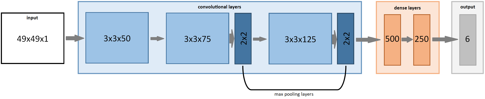

# EmotionAnalyzer #
This is the code for a convolutional neural network that is able to predict the emotions of a person in an image. This repository contains scripts to prep the data for training, train the model and a script that uses your webcam so you can see the model perform in real-time.

This was created for the CodeDay Hackathon in the late summer of 2020. Nobody in our group has ever made a neural network before and we thought this would be a unique challenge and learning experience to try out.

# Setting up the Environment #
First we need to setup Keras, the deep learning API we will be using. We will be using Tensorflow as the background.

If your computer has an NVIDIA GPU and you wish to utilize it (which is highly reccomended) go ahead and follow the directions [here](https://github.com/antoniosehk/keras-tensorflow-windows-installation).

If you don't have a NVIDIA GPU, go ahead and install Anaconda (instructions [here](https://docs.anaconda.com/anaconda/install/)). Anaconda comes with Tensorflow which has keras built-in.

Additionally, we need to install:
* OpenCV
* NumPy
* matplotlib
* pandas
* tqdm

# Key Files #
Here is a list of the key files within the repository and what they do:
* `clean_data.py` - this takes a directory full of images as well as an index listing each file and there associated emotion and will split the images into each emotion present in the dataset (for the training set).
* `prep_data.py` - this takes the cleaned training and test images, and prepares them for training. It stored the prepped data in pickle files within `data/`.
* `training.py` - this builds, compiles and trains the model using the training set. It evaluates the newly-trained model using the test set.
* `analyzer.py` - this shows the model in action by showing a live feed of your webcam and predicting the emotions exhibted by any faces within the frame.
* `features.pickle` - this contains the images from the training set processed by `prep_data.py`.
* `labels.pickle` - this contains the corresponding labels for the images in `features.pickle`.
* `test_features.pickle` - this, you guessed it, contains the images from the test set processed by `prep_data.py`.
* `test_labels.pickle` - this contains the corresponding labels for the images in `test_features.pickle`.

# The Dataset #
The dataset can be obtained [here](https://www.kaggle.com/apollo2506/facial-recognition-dataset?). It contains 35,340 images, split into a training and test set.

Here is the breakdown of the training set:
* Angry - 3,995
* Fear - 4,097
* Happy - 7,215
* Neutral - 4,965
* Sad - 4,830
* Surprise - 3,171

Here is the breakdown of the test set:
* Angry - 958
* Fear - 1,024
* Happy - 1,774
* Neutral - 1,223
* Sad - 1,247
* Surprise - 831

We chose this set because the entries for each emotion in the training set were fairly close compared to other sets we found. This way it wouldn't be biased towards one emotion or another.
Each image has a dimension of 48x48 pixels.

# The Model Architecture #
The architecture we used is a convolutional neural network with 6 output neurons, one for each of the 6 emotions the model can predict. It consists of two parts - the convolutional layers and the dense layers.
The input is a grayscale image with a resolution of 49x49 pixels.

First, the input goes through 3 convolutional layers, with the last 2 having a max pooling layer afterwards. The convolutional layers have 50, 75, and 125 filters. Each layer has 3 square filters, and both max pooling layers have a 2 square patch.

We then used two dense layers with 500 and 250 neurons. Each of the dense layers have a droupout as well, with a drop probability of 0.3 for the first one and 0.2 for the second. We chose a ReLU activation for both the convolutional and dense layers (mainly because we found it's faster).

We ended up training it with a batch size of 64 and we performed 12 epochs. This ended up only being 56.9% accurate on the test set, but it was the best we could do given the time we had and the performance isn't too bad.

# See it in Action #
To see the model performing in real-time, go ahead and run `python analyzer.py`. It requires a webcam and will make predictions on the emotions expressed by all the faces within the frame. You will also need a trained model, which you can get [here](https://drive.google.com/file/d/1f1kKpxHN50B55sdzb66lPISDRxlLJU0n/view?usp=sharing) Here's what it looks like:

What this essenitally does for each frame is it first runs a cascade classifier that finds all the faces within the frame. Once it does that, it goes through each face and runs it through the model to get a prediction. This is capable of handling multiple faces, though you need to compute power to back it up. In the example above it was only able to achieve 12-14 fps with the assistance of an RTX 2070. In an attempt to increase performance we implmented double buffering so the main pipeline doesn't have to wait around for frames from the webcam. This increased fps by 30-40%, but the model is still very heavy.